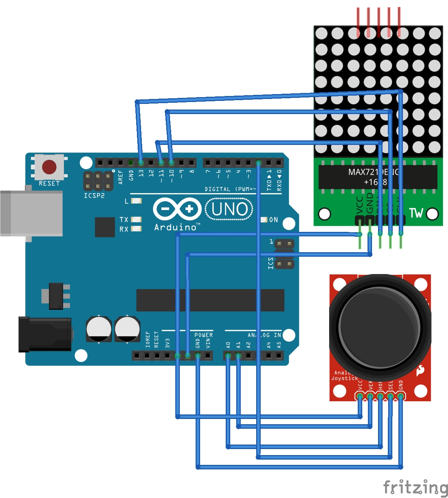

# Tetris
Classic tetris-game with Arduino starter kit. Joystick and 8x8 LED-matrix 7219. 

In Arduino IDE software add libraries: (IDE → Tools → Manage Libraries→ add LedControl (Eberhard Fahle))

Wiring:

MAX7219 8×8 matrix -> Arduino

VCC -> 5V

GND ->	GND

DIN ->	D11

CLK ->	D13

CS ->	D10

Joystick ->	Arduino

VRx	-> A0

VRy	-> A1

SW	-> D2

VCC	-> 5V

GND	-> GND

